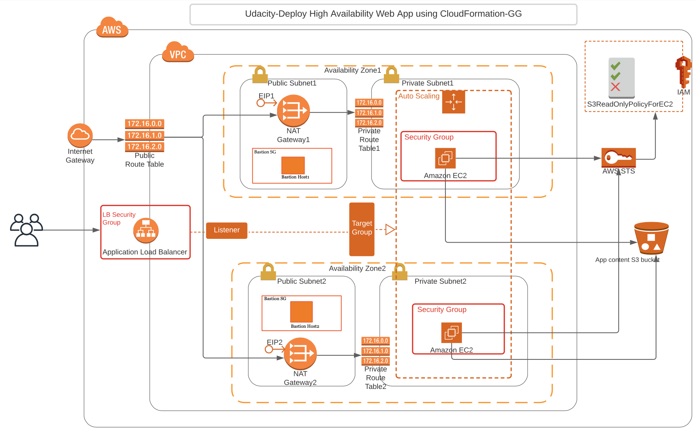

# Deploy a high-availability web app using CloudFormation
In this project, I have deployed web servers for a highly available web app using CloudFormation. I have written the code that creates and deploys the infrastructure and application for a demo app from the ground up. I began with deploying the networking components, followed by servers, security roles and software. I have followed industry following best practices and have used scripting as much as possible.
## Features

1. Entire application can be taken down and brought back up using CloudFormation scripts in this repo.
2. Web servers are deployed in 2 different AZs inside a single region with auto-scaling capability.
3. EC2 instances are secured in a private subnet and only accepts traffic originating from a bastion host and load-balancer both within a public subnet.
4.  Load-balancer, bastion host, and web servers have security groups defined with only needed ports opened.
5.  Web servers have outbound internet access via NAT gateway for critical OS updates and patches.
6.  Sample application code is packaged and stored in an S3 bucket with IAM permissions.
7.  Web servers are configured with IAM instance profile to be able to access and download application code from AWS S3 bucket.
8. Health checks and thresholds are defined to aid in system availability detection.
## Detailed Infrastructure Architecture

    

## Steps

1. Create an AWS free tier account and setup billing alerts.
2. Install and configure `AWS cli` at your local machine.
3. Create a S3 bucket and upload the `udacity.zip` file which is located under `WebApplication` folder of this repository.
4. Edit the S3 bucket policy and paste the content of `S3BucketPolicy.txt` file and save the changes. The `S3BucketPolicy.txt` file is located under `WebApplication` folder of this repository.
5. Note down the name of S3 bucket created in above step and update the `S3CodeRepo` ParameterValue inside `servers.json` file. The `servers.json` file is located under `CFScripts` folder of this repository.
6. Create a Key Pair in AWS EC2 and save the downloaded Key Pair at some location on your machine. Note down the Key Pair name and update the `KeyPairName` ParameterValue inside `servers.json` file with the name of the key pair created. The `servers.json` file is located under `CFScripts` folder of this repository.
7. Run `./create infra infra.yml infra.json`
8. Run `./create servers servers.yml servers.json`
9. Copy the DNS url from Outputs section of servers CloudFormation stack. Paste the url in the browser and you will see `It works! Udagram, Udacity` on the web page.
10. Run `./delete servers`
11. Run `./delete infra`

## Troubleshoot any issue with web servers

As web servers are located in private subnets, you can verify the logs using jump box i.e. Bastion host. Below are the steps to login into web servers:
1. Open a terminal on you local machine in `bash` mode and copy the Key Pair on bastion host's `/home/ubuntu` directory. For this, run command ` scp -i key-pair-name.pem key-pair-name.pem ubuntu@public-ip-of-bastion-host:/home/ubuntu`. In this command, replace `public-ip-of-bastion-host` with the bastion host's public IP and `key-pair-name` with the name of the pem file(Key Pair) downloaded in `Steps` section.
2. Open the `SSH client` on your local machine and login into bastion host using the Key Pair downloaded in `Steps` section. For this run command `ssh ubuntu@public-ip-of-bastion-host -i key-pair-name.pem`. In this command, replace `public-ip-of-bastion-host` with the bastion host's public IP and `key-pair-name` with the name of the pem file(Key Pair) downloaded in `Steps` section.
3. Run command `chmod 400 key-pair-name.pem`.
4. Run command `ssh ubuntu@private-ip-of-web-server -i key-pair-name.pem`. Replace `private-ip-of-web-server` with the web server's private IP and `key-pair-name` with the name of the pem file(Key Pair) downloaded in `Steps` section.
5. Now you are inside web server and can verify the required logs in order to troubleshoot any issue encountered with the running application.